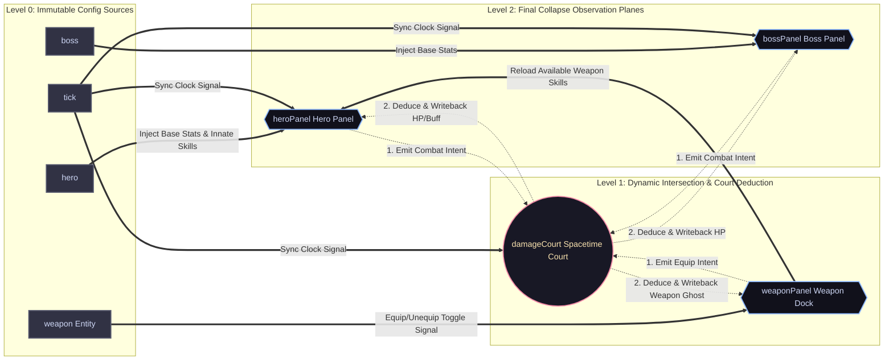
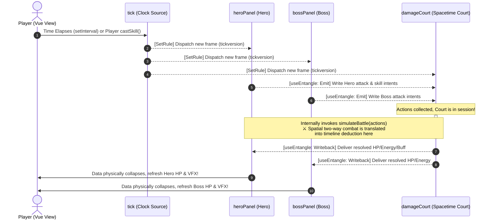

# MeshFlow

> **Logic as a Force Field, collapsing to the lowest potential.**

[English] | [中文](./readme_zh.md) 

  

## ⚔️ Combat Sandbox Demo

This arena is a high-frequency, deterministic state deduction sandbox built on top of the **MeshFlow** static topology task orchestration engine. By simulating a typical real-time "Hero vs. Boss" combat flow, it visually demonstrates the engine's low-level scheduling capabilities when handling **Static Task Topology**, **Cross-node Dynamic Task Entanglement**, and **Epoch-based Time Travel**.

> [!NOTE]
> **💡 Core Design Breakthrough: Flattening Spatial Infinite Loops with Time**
> 
> In high-frequency task orchestration, nodes can easily form mutually locked **cyclic dependencies** (e.g., Weapon Adaptation ⇄ Buff Self-Cleansing). Instead of relying on complex black-box algorithms, MeshFlow utilizes the timeline (Epoch evolution) to flatten spatial loop deadlocks into a unidirectional Directed Acyclic Graph (DAG) schedule, structurally eradicating Stack Overflows.

---

  

## 🎮 Live Convergence Showcase: The 1000-500-250 Equilibrium

The GIF above demonstrates MeshFlow's capability to resolve **Cyclic Dependencies** through **Iterative Relaxation**. 

We intentionally injected a "Logic Loop" into this 3x3 matrix to challenge the engine:
* **Core (N5)**: The "Ignition Source", manually injected with **1000** energy.
* **Cross Nodes (N2, N4, N6, N8)**: Depend 80% on the Core, but reverse-depend 20% on the adjacent Corners.
* **Corner Nodes (N1, N3, N7, N9)**: Depend entirely on the average of adjacent Crosses.

**What to Observe:**
Notice the ripple and the oscillation. In Async Mode, the values don't just jump directly to their targets. They "shiver" and climb, reflecting the engine's internal **Epoch transitions**. Despite the infinite loop in the formulas, MeshFlow's damping mechanism forces the system to collapse into a perfect, mathematically elegant equilibrium: **1000 (Center) → 500 (Cross) → 250 (Corner)**.

> **Technical Feat**: Traditional reactive frameworks (like standard Hooks or simple Observables) would trigger a **Stack Overflow** or infinite re-renders here. MeshFlow treats this as a **Damped Harmonic Oscillator**, structurally eliminating infinite loops and finding the steady-state solution in milliseconds.

---

**MeshFlow** is a reactive topology scheduling engine based on the **"Logic Force Field"**.

Instead of relying on complex black-box algorithms, it builds on a simple physical intuition: **abstracting logical dependency depth as physical altitude**. By utilizing the core **"Waterline Gate"** scheduling strategy, MeshFlow allows complex asynchronous interactions to spontaneously converge—like water flowing downhill—structurally eliminating asynchronous race conditions, diamond dependencies, and cyclic constraints.
 
## 🌌 Core Design: What is a "Logic Force Field"?

The "Logic Force Field" is not a fictional theory, but a design model that **abstracts logic into physical potential energy**. MeshFlow simulates the spontaneous convergence of the physical world across three dimensions:

### 1. Logical Depth = Physical Altitude (Topological Gradient)
In MeshFlow, every node resides at a different "altitude."
* **Gravitational Orbits**: The execution order defined by `SetRule` establishes "gravitational orbits" flowing from high to low potential.
* **Spontaneous Evolution**: Once the source data changes, the system leverages this "potential difference" to drive data automatically downstream along the topological path, much like water, without manual triggering.

### 2. Waterline = Gate Control (Waterline Gate)
To handle "diamond dependencies," the force field introduces a tiered gate-control mechanism.
* **Equipotential Synchronization**: Nodes at the same depth level are considered to be on the same "waterline."
* **Out-of-Order Prevention**: The gate to the next level opens *only* when all logic (including asynchronous Promises) at the current level is fully settled and the waterline is "leveled." This guarantees that downstream nodes are never erroneously triggered during an unstable intermediate state.

### 3. Energy Dissipation = Logic Collapse (Energy Dissipation)
System evolution is essentially the dissipation of energy. To ensure the system eventually returns to rest, MeshFlow distinguishes between three convergence mechanisms:

- **Directed Convergence (DAG)**: In unidirectional orbits, energy spontaneously zeroes out after flowing through the waterlines. This is a deterministic rest guaranteed by the topology.
- **Damped Convergence (Cycle)**: In entangled loops, the concept of **Damping** is introduced. When the logical variance is less than a user-defined threshold, the node should stop emitting new prophecies (`emit`), and the system enters a silent state. This "logical friction" overcomes the inertia of cyclic oscillation, forcing the system to collapse to the **lowest potential point**.
- **Fused Convergence (Circuit Breaker)**: If the user fails to provide damping constraints, or if the oscillation exceeds safety boundaries, the engine will determine that the energy is diverging and immediately execute a forced fuse to protect computing resources.

---

## ✨ Engine Features

- **⚡ Extreme Pruning (Energy Dissipation)**: A memoization mechanism based on bucket computing automatically identifies and truncates invalid energy propagation paths.
- **🛡️ Temporal Barrier**: Relying on **Token and Version** mechanisms, it completely eradicates "ghost updates" caused by asynchronous callbacks. The system automatically discards obsolete prophecies, ensuring the logic evolution never drifts.
- **📦 Framework Agnostic**: Zero external dependencies, ~10kB footprint. Seamlessly integrates with Vue, React, or Vanilla JavaScript.
 

## 🧪 Laboratory (Live Demos)

Witness how logic automatically achieves potential collapse within complex constraint fields:
* 👉 **[The 9-Node Entanglement Matrix](https://meshflow-docs.nzyhave.fun/demos/matrix)**
 
 

## 📂 Source Map

The core scheduling logic resides in: [`utils/core/`](./utils/core/)  

*Code is the force field; logic is physics.*
 

## 📜 License

This project is licensed under the [GNU AGPL v3.0](./LICENSE).