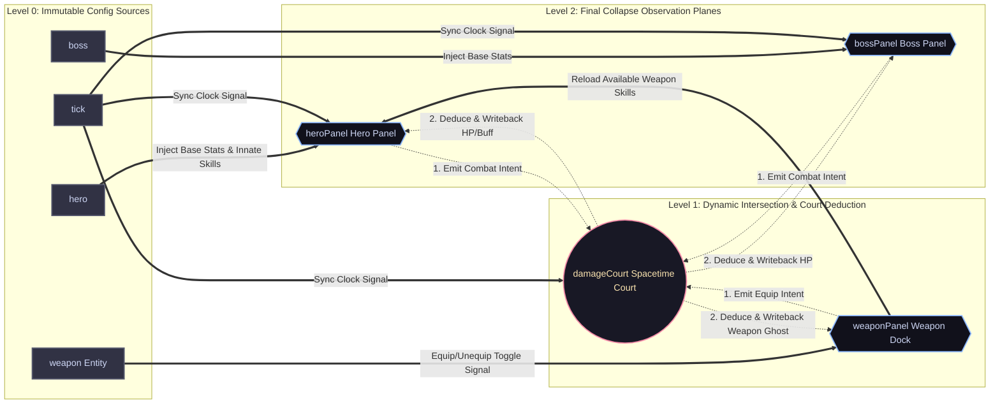
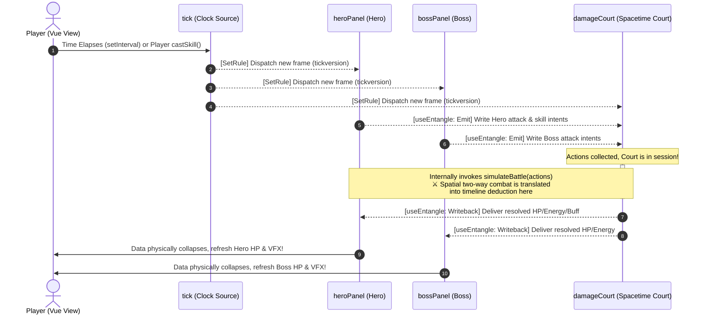

# MeshFlow

> **Logic as a force field, collapsing to its lowest potential energy.**

[English] | [中文](./README.md)

[](https://www.gnu.org/licenses/agpl-3.0)
[](https://meshflow-docs.nzyhave.fun/)

**MeshFlow** is a lightweight, zero-dependency **Static Topology Task Orchestration & State Convergence Engine** specifically architected for complex Directed Graph networks.

It abstracts intricate business workflow orchestrations into physical **potential energy dissipation**. Driven by its core **"Watermark Gate"** scheduling strategy, MeshFlow forces convoluted synchronous/asynchronous task chains to self-converge spontaneously—like water flowing naturally to lower ground. This structurally eradicates async race conditions, diamond dependency anomalies, and spatial circular deadlocks.

---

## 🎮 Core Convergence Showcase

<p align="center">
  
</p>

### 📈 The 1000-500-250 Damped Convergence Challenge
The animation above visually demonstrates MeshFlow handling a manually injected **"logical infinite loop (circular dependency)"** within a 3x3 node matrix. Under this scenario, traditional reactive frameworks (such as native Hook chains or watch dependency graphs) instantly trigger a **Stack Overflow** or trap the system in an infinite re-rendering cycle.

MeshFlow treats the network as a **Damped Harmonic Oscillator**. By introducing "logical friction" via highly efficient **Iterative Relaxation**, it forces the entire system to dissipate oscillatory energy within milliseconds. The system smoothly collapses into a mathematically perfect equilibrium state: **1000 (Central Ignition Source) → 500 (Cross Dependencies) → 250 (Corner Confluences)**.

---

## 🚀 3-Minute Quick Start

MeshFlow adopts a pure Headless design, enforcing a physical separation between core scheduling logic and the presentation layer (View). Utilizing explicit **Protocol Modules**, you can easily slice any non-structured metadata (Schema) and register them into the topological field.

### 1. Install Core
```bash
npm install @meshflow/core

```

### 2. Define Your Business Protocol Module

By invoking the low-level `registerNode` API, you construct explicit logical grid points and export lossless observation views via `createView`:

<details>
<summary>📦 展开注册代码</summary>

```typescript
import { useScheduler, MeshPath } from "@meshflow/core";

function useInternalForm<T, P extends MeshPath>(
    scheduler: ReturnType<typeof useScheduler<T, P>>,
    rootSchema: any
) {
    // 1. Explicitly register the parent Group topology
    const billingGroup = scheduler.registerGroupNode({
        path: "billing" as P,
        type: "group",
        children: ["billing.count", "billing.price", "billing.totalPrice", "billing.priceDetail"] as P[],
        meta: rootSchema,
    });

    // 2. Batch deconstruct and register leaf nodes
    const renderedChildren = rootSchema.children.map((field: any) => {
        const currentPath = `billing.${field.name}` as P;
        return scheduler.registerNode({
            path: currentPath,
            type: field.type,
            state: { value: field.value },
            meta: field,
            notifyKeys: new Set(),
        }).createView();
    });

    const uiSchema = billingGroup.createView({ children: renderedChildren });
    const GetFormData = () => ({
        billing: {
            count: scheduler.GetNodeByPath("billing.count" as P).state.value,
            price: scheduler.GetNodeByPath("billing.price" as P).state.value,
            totalPrice: scheduler.GetNodeByPath("billing.totalPrice" as P).state.value,
            priceDetail: scheduler.GetNodeByPath("billing.priceDetail" as P).state.value,
        }
    });

    return { uiSchema, GetFormData };
}

```
</details>

### 3. Activate the Logical Brain and Establish Gravity Orbits

Inject the raw Schema using your wrapped module. Once injected, MeshFlow takes full command of the orchestration as the system's "computational brain." Bridging the engine's convergence potential into your view layer is incredibly lightweight—done here with a simple Vue `ref` counter acting as a `UITrigger`:

```typescript
import { ref } from "vue";
import { useMeshFlow, MeshPath } from "@meshflow/core";

// Raw Metadata Schema
const schema = {
    type: "group",
    path: "billing",
    label: "Billing & Summary",
    children: [
        { type: "number", path: "count", label: "Quantity", value: 1 },
        { type: "number", path: "price", label: "Unit Price", value: 1000 },
        { type: "number", path: "totalPrice", label: "Estimated Monthly Total", value: 0 },
        { type: "input", path: "priceDetail", label: "Billing Description", value: "Base Config Fee" },
    ],
};

// Initialize the Logical Field
const engine = useMeshFlow("engine_instance", schema, {
    UITrigger: {
        signalCreator: () => ref(0), // Ultra-lightweight Vue reactive dirty-checker
        signalTrigger(signal) { signal.value++; } // Triggers atomic view updates upon node displacement
    },
    modules: { useInternalForm }
});

// 4. Orchestrate Unidirectional Gravity Orbits (SetRules)
// The Watermark mechanism ensures that no matter how deep or async the graph is, 
// every single epoch evolution remains strictly unidirectional, deterministic, and atomic.
engine.config.SetRules(
    ["billing.count", "billing.price"], // Static upstream dependencies
    "billing.totalPrice",               // Target sink for final collapse
    "value",                            // Observed target key
    {
        logic: ({ slot }) => {
            const [count, price] = slot.triggerTargets;
            return count.value * price.value; // Pure function downflow, cutting off intermediate oscillations
        },
        triggerKeys: ["value"]
    }
);

// Ignite signal to find the initial atomic watermark level
engine.notifyAll();

// 5. Interactive Ignition: Simulate a user changing the "Quantity"
engine.data.StageValue("billing.count" as MeshPath, "value", 5);
engine.data.Commit(); // Commit staging buffer to trigger a new convergence epoch

// The total price automatically calculates to 5000, and the Vue view atomizes updates!
console.log(engine.modules.useInternalForm.GetFormData().billing.totalPrice); // 🚀 Outputs: 5000

```

* 👉 **[Live Interactive Demo: Click here to view the live Billing Form linkage](https://meshflow-docs.nzyhave.fun/)**

---

## ⚔️ Advanced Case Study: Combat Sandbox

While the billing form demonstrates standard unidirectional DAG flows, this hardcore **Real-time Combat Sandbox** was engineered to stress-test the engine's absolute limits under **Cross-node Dynamic Task Entanglement** and **Epoch-based Time Travel**.

### ⚔️ Spacetime Combat Sandbox Demo

This simulator orchestrates a high-frequency, deterministic state deduction sandbox. By simulating a typical "Hero vs. Boss" real-time combat pipeline, it visually showcases the runtime's low-level scheduling capabilities across static graph limits and temporal unwinding.

* 👉 **[Live Interactive Demo: Click here to view the Combat Sandbox](https://www.google.com/search?q=https://meshflow-docs.nzyhave.fun/demos/hero.html)**

Below are the architectural topology maps and sequence lifecycles governing the combat simulation sandbox:

### 🗺️ Combat Sandbox Static Task Topology



### ⏳ Spacetime Court Sequence Lifecycle



👉 **[Live Document Site: Experience Spacetime Court deduction and history-travel timelines](https://meshflow-docs.nzyhave.fun/)**

---

## ✨ Core Engine Features

* **⚡ Surgical Extreme Pruning**: Memory-mapped memoization built on bucket computations. It tracks value shifts to intercept and truncate invalid propagation waves instantly, keeping high-frequency computation costs near $O(1)$.
* **🛡️ Temporal Causal Barrier**: Backed by a transactional scheduling lock and Staging Buffers. Gates open to downstream layers *only* when all current level dependencies completely "level out," entirely eliminating dirty reads during high-frequency mutation torrents.
* **📦 Completely Framework Agnostic**: Zero external runtime dependencies. A pure Headless scheduling core exporting immaculate observation views (`View`), bridging natively into Vue, React, or vanilla TypeScript pipelines.
 

## 📂 Source Map

The core scheduling logic resides in: [`utils/core/`](./utils/core/)  

*Code is the force field; logic is physics.*
 

## 📜 License

This project is licensed under the [GNU AGPL v3.0](./LICENSE).
 