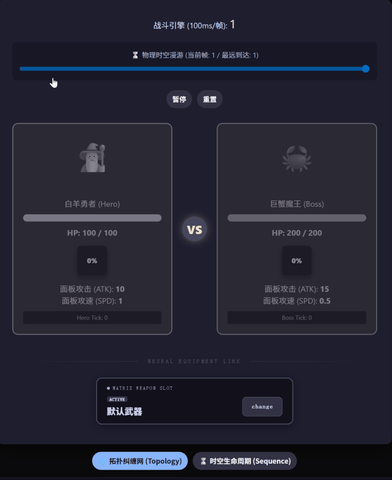
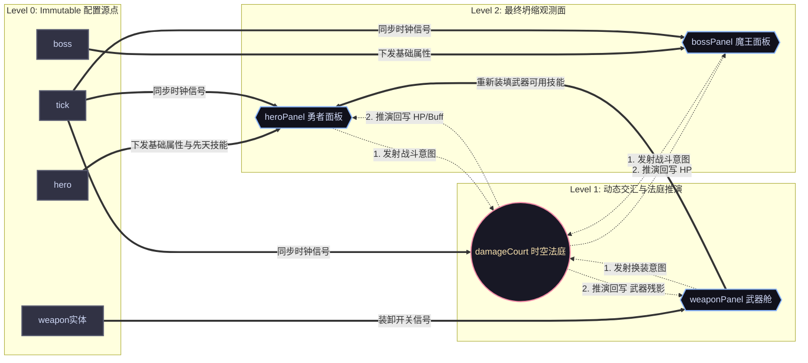
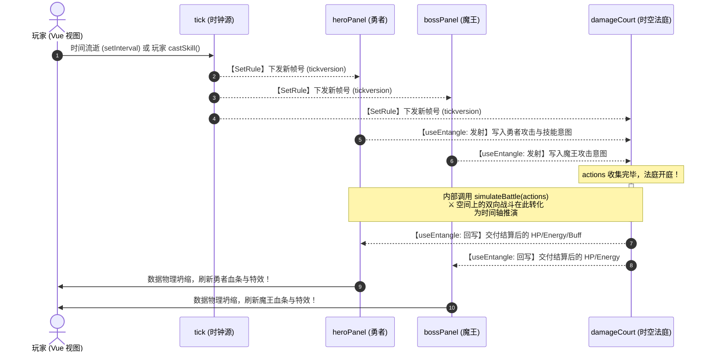
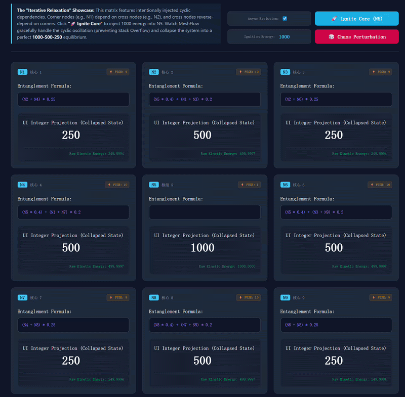

# MeshFlow

> **逻辑如力场，坍缩至势能最低处。**

[English](./readme.md) | [中文] 

  

## ⚔️ 时空沙盒战斗演练场 (Combat Sandbox Demo)

本演练场是基于 **MeshFlow** 静态拓扑任务编排引擎构建的高频、确定性状态推演沙盒。通过模拟一个典型的“勇者对抗魔王”的实时战斗流，可视化展示了引擎在处理**静态任务拓扑图（Static Task Topology）**、**跨节点动态因果纠缠（Task Entanglement）**以及**周期重演（Epoch-based Time Travel）**时的底层调度能力。

> [!NOTE]
> **💡 核心设计破局：用时间拉平空间死循环**
> 
> 在高频任务编排中，节点间极易形成互相锁死的**循环依赖**（如：武器适配 ⇄ Buff自清洗）。MeshFlow 不去玩复杂的黑盒算法，而是利用时间轴（Epoch 周期演进）将空间维度的环路死锁，拉平成单向的有向图（DAG）调度，从结构上彻底消灭 Stack Overflow。

---

  

## 🎮 实时收敛演示：1000-500-250 坍缩挑战

上方的 GIF 展示了 MeshFlow 如何通过**迭代松弛 (Iterative Relaxation)** 优雅地解决**循环依赖 (Cyclic Dependencies)** 难题。

为了挑战引擎极限，我们在 3x3 矩阵中故意注入了“逻辑死循环”：
* **核心节点 (N5)**：“点火源”，被手动注入 **1000** 能量。
* **十字节点 (N2, N4, N6, N8)**：80% 依赖核心，但有 20% **反向依赖**于相邻的边角节点。
* **边角节点 (N1, N3, N7, N9)**：100% 依赖于相邻十字节点的平均值。

**观测重点：**
注意观察信号的扩散与震荡。在异步演进模式下，数值并不是瞬间跳变到目标值，而是会经历“颤动”和攀升，这反映了引擎内部的**纪元更迭 (Epoch Transitions)**。尽管公式中存在无限循环，MeshFlow 的阻尼机制依然迫使系统坍缩至一个完美、优雅的数学平衡态：**1000 (中心) → 500 (十字) → 250 (边角)**。

> **架构突破**：传统的响应式框架（如原生 Hooks 或简单的 EventEmitter）在这里会直接引发 **栈溢出 (Stack Overflow)** 或无限重渲染。而 MeshFlow 将其视为**阻尼谐振子 (Damped Harmonic Oscillator)**，从结构上消灭了死循环，在毫秒级内收敛至稳态。

---

**MeshFlow** 是一款基于 **“逻辑力场 (Logic Force Field)”** 的高性能响应式拓扑调度引擎。

它不依赖复杂的黑盒算法，而是基于朴素的物理直觉——**将逻辑连动的深度抽象为物理高度**。利用核心的 **“水位线闸门 (Waterline Gate)”** 调度策略，MeshFlow 能让复杂的异步联动像水往低处流一样自发收敛，从结构上彻底解决异步竞态、钻石依赖与循环约束难题。
 

## 🌌 核心设计：什么是“逻辑力场”？

“逻辑力场”并非虚构的理论，而是一套将逻辑**抽象为物理位能**的设计模型。MeshFlow 通过以下三个维度模拟物理世界的自发收敛：

### 1. 逻辑深度 = 物理高度 (Topological Gradient)
在 MeshFlow 中，每一个节点都处在不同的“海拔”上。
* **引力轨道**：通过 `SetRule` 定义的先后顺序，实际上建立了从高位向低位流淌的“引力轨道”。
* **自发演化**：一旦源头数据发生变化，系统利用这种“势能差”驱动数据像水一样顺着拓扑路径自动向下游传播，无需手动触发。

### 2. 水位线 = 闸门控制 (Waterline Gate)
为了处理“钻石依赖”，力场引入了分层管理的闸门机制。
* **等位同步**：同一层级的节点被视为在同一“水位线”上。
* **防乱序**：只有当当前层级的所有逻辑（包括异步 Promise）彻底结算、水位“找平”后，下一层的闸门才会开启。这确保了下游节点永远不会在不稳定的中间态被错误触发。

### 3. 能量耗散 = 逻辑坍缩 (Energy Dissipation)
系统的演化本质上是能量的耗散。为了确保系统最终回归静止，MeshFlow 区分了三种收敛机制：

- **有向收敛 (DAG)**：在单向轨道中，能量随水位线流尽后自发归零。这是由拓扑结构保证的确定性静止。
- **阻尼收敛 (Cycle)**：在纠缠回路中，引入 **阻尼 (Damping)** 概念。当逻辑变化量小于预设阈值时，节点停止发射新预言 (`emit`)，系统进入静默态。这种“逻辑摩擦力”克服了循环震荡的惯性，迫使系统向 **势能最低点** 坍缩。
- **熔断收敛 (Circuit Breaker)**：如果用户未提供阻尼约束，或震荡超出了安全边界，引擎将判定为能量发散，立即执行强制熔断以保护计算资源。

---

## ✨ 引擎特性

- **⚡ 极致剪枝 (Extreme Pruning)**：基于桶计算的记忆化机制，自动识别并截断无效的能量传导路径。
- **🛡️ 时序屏障 (Temporal Barrier)**：依托 **Token 与 Version** 机制，彻底杜绝异步回调产生的“幽灵更新”。系统自动丢弃过时的预言，确保逻辑演化永不偏移。
- **📦 框架无关 (Framework Agnostic)**：零外部依赖，核心体积极小。完美适配 Vue、React 或原生 JavaScript。
 

## 🧪 实验场 (Live Demos)

观测逻辑如何在复杂约束场中自动完成势能坍缩：
* 👉 **[九宫格纠缠矩阵 (The 9-Node Matrix)](https://meshflow-docs.nzyhave.fun/demos/matrix)**
 
 

## 📂 源码导览 (Source Map)

核心调度逻辑位于：[`utils/core/`](./utils/core/)  

*代码即是力场，逻辑即是物理。*
 

## 📜 协议 (License)

本项目采用 [GNU AGPL v3.0](./LICENSE) 协议。