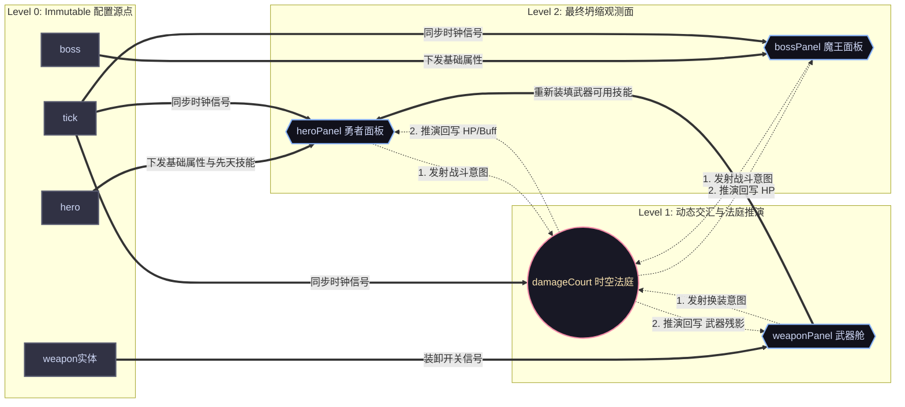
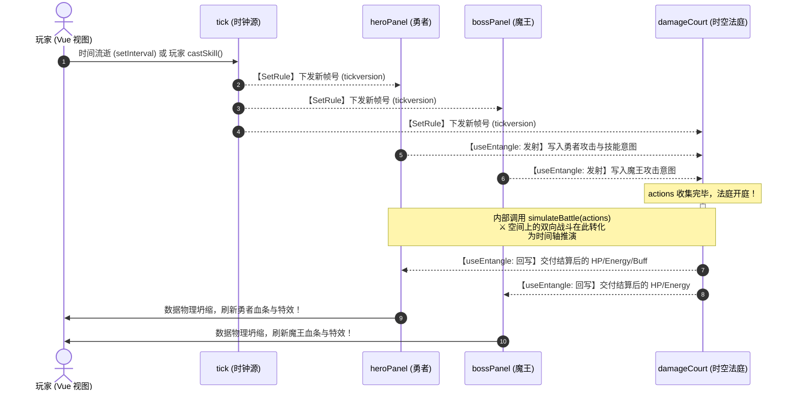

# MeshFlow

> **逻辑如力场，坍缩至势能最低处。**

[English](./readme.md) | [中文] 

[](https://www.gnu.org/licenses/agpl-3.0)
[](https://meshflow-docs.nzyhave.fun/)

**MeshFlow** 是一款专为复杂有向图（Graph）网络设计的轻量级、零依赖**静态拓扑任务编排与状态收敛引擎**。

它将复杂的业务流流转抽象为物理世界的**势能耗散**。依托核心的 **“水位线闸门 (Watermark Gate)”** 调度策略，MeshFlow 让错综复杂的同步/异步任务联动像水往低处流一样自发收敛，从结构上彻底根治异步竞态、钻石依赖与空间循环死锁。

---

## 🎮 极限收敛演示 (Core Showcase)

<p align="center">
  
</p>

### 📈 1000-500-250 阻尼收敛挑战
上图直观展示了 MeshFlow 在 3x3 矩阵中被故意注入**“逻辑死循环（循环依赖）”**时的表现。传统的响应式框架（如原生的 Hooks 链或 Watch 依赖链）在面对此类场景时会瞬时引发**栈溢出 (Stack Overflow)** 或引发无限死循环重渲染。

MeshFlow 将其视为**阻尼谐振子 (Damped Harmonic Oscillator)**，通过本地高效的**迭代松弛（Iterative Relaxation）**引入“逻辑摩擦力”，迫使整个系统在毫秒级内自发消散震荡能量，精准坍缩至全局完美的数学平衡稳态：**1000 (中心点火源) → 500 (十字依赖) → 250 (边角汇聚)**。

---

## 🚀 3分钟快速上手 (Quick Start)

MeshFlow 采用完全的 Headless 设计，核心逻辑与表现层（View）物理隔离。

### 1. 安装核心
```bash
npm install @meshflow/core
```

### 2. 定义业务注册模块 (Protocol Module)

通过调用底层的 `registerNode`，显式建立逻辑格点，并通过 `createView` 导出无损的观测视图：

<details>
<summary>📦 展开注册代码</summary>


```typescript
import { useScheduler, MeshPath } from "@meshflow/core";

function useInternalForm<T, P extends MeshPath>(
    scheduler: ReturnType<typeof useScheduler<T, P>>,
    rootSchema: any
) {
    // 1. 显式注册父节点 Group 拓扑
    const billingGroup = scheduler.registerGroupNode({
        path: "billing" as P,
        type: "group",
        children: ["billing.count", "billing.price", "billing.totalPrice", "billing.priceDetail"] as P[],
        meta: rootSchema,
    });

    // 2. 批量物理打碎，注册叶子节点格点
    const renderedChildren = rootSchema.children.map((field: any) => {
        const currentPath = `billing.${field.name}` as P;
        return scheduler.registerNode({
            path: currentPath,
            type: field.type,
            state: { value: field.value },
            meta: field,
            notifyKeys: new Set(),
        }).createView();
    });

    const uiSchema = billingGroup.createView({ children: renderedChildren });
    const GetFormData = () => ({
        billing: {
            count: scheduler.GetNodeByPath("billing.count" as P).state.value,
            price: scheduler.GetNodeByPath("billing.price" as P).state.value,
            totalPrice: scheduler.GetNodeByPath("billing.totalPrice" as P).state.value,
            priceDetail: scheduler.GetNodeByPath("billing.priceDetail" as P).state.value,
        }
    });

    return { uiSchema, GetFormData };
}

```
</details>

### 3. 激活逻辑大脑并建立引力轨道

利用包装好的模块注入原始 Schema。注入后，MeshFlow 将作为“计算大脑”彻底接管全网调度。利用一个极简的 Vue `ref` 计数器作为 `UITrigger`，即可完成力场向视图层的原子级视图桥接：

```typescript
import { ref } from "vue";
import { useMeshFlow } from "@meshflow/core";

// 原始元数据 Schema
const schema = {
    type: "group",
    path: "billing",
    label: "计费与汇总",
    children: [
        { type: "number", path: "count", label: "购买数量", value: 1 },
        { type: "number", path: "price", label: "单价", value: 1000 },
        { type: "number", path: "totalPrice", label: "预估月度总价", value: 0 },
        { type: "input", path: "priceDetail", label: "计费项说明", value: "基础配置费用" },
    ],
};

// 初始化逻辑力场
const engine = useMeshFlow("engine_instance", schema, {
    UITrigger: {
        signalCreator: () => ref(0), // 极其轻量的 Vue 响应式脏检查器
        signalTrigger(signal) { signal.value++; } // 发生位移时原子级触发视图更新
    },
    modules: { useInternalForm }
});

// 4. 编排引力因果轨道 (SetRules)
// 水位线机制确保了无论逻辑链路多深、是否包含异步，每一帧的演化都是单向、确定且原子的
engine.config.SetRules(
    ["billing.count", "billing.price"], // 静态上游依赖
    "billing.totalPrice",               // 最终消费坍缩的目标
    "value",                            // 观测的指定 Key
    {
        logic: ({ slot }) => {
            const [count, price] = slot.triggerTargets;
            return count.value * price.value; // 纯函数顺流而下，斩断钻石依赖与中间震荡
        },
        triggerKeys: ["value"]
    }
);

// 信号点火，驱动全网原子级水位找平
engine.notifyAll();

```
 
* 👉 **[在线交互：点击查看该计费表单](http://localhost:5173/guide/getting-started.html)**

---

## ⚔️ 进阶实战：时空沙盒战斗演练场 (Combat Sandbox)

如果说基础表单展现的是 MeshFlow 在单向 DAG 上的确定性流淌，那么这个硬核的**实时战斗演练场**则是为了验证引擎在处理**跨节点动态因果纠缠（Task Entanglement）**以及**周期重演（Epoch-based Time Travel）**时的极限吞吐与架构韧性。

<p align="center">
  
</p>

### ⚔️ 时空沙盒战斗演练场 (Combat Sandbox Demo)

本演练场是基于 **MeshFlow** 静态拓扑任务编排引擎构建的高频、确定性状态推演沙盒。通过模拟一个典型的“勇者对抗魔王”的实时战斗流，可视化展示了引擎在处理**静态任务拓扑图（Static Task Topology）**、**跨节点动态因果纠缠（Task Entanglement）**以及**周期重演（Epoch-based Time Travel）**时的底层调度能力。

* 👉 **[在线交互：点击查看沙盒战斗](http://localhost:5173/demos/hero.html)**
 
下面是沙盒战斗模型节点拓扑关系与时序图：




---

## ✨ 引擎特性

- **⚡ 极致剪枝 (Extreme Pruning)**：基于桶计算的记忆化机制，自动识别并截断无效的能量传导路径。
- **🛡️ 时序屏障 (Temporal Barrier)**：依托 **Token 与 Version** 机制，彻底杜绝异步回调产生的“幽灵更新”。系统自动丢弃过时的预言，确保逻辑演化永不偏移。
- **📦 框架无关 (Framework Agnostic)**：零外部依赖，核心体积极小。完美适配 Vue、React 或原生 JavaScript。
 
 

## 📂 源码导览 (Source Map)

核心调度逻辑位于：[`utils/core/`](./utils/core/)  

*代码即是力场，逻辑即是物理。*
 

## 📜 协议 (License)

本项目采用 [GNU AGPL v3.0](./LICENSE) 协议。
